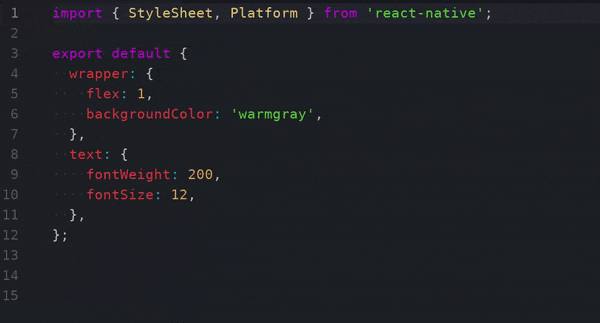

# atom-react-native-debug-style

A simple atom package to make faster the use of [react-native-debug-stylesheet](https://github.com/brentvatne/react-native-debug-stylesheet)

## Demo

## Shorcuts

Toggle: `Ctrl + Alt + O`

## Author

* [**angel-rs**](https://github.com/angel-rs) - *Initial work*

## License

This project is licensed under the MIT License
